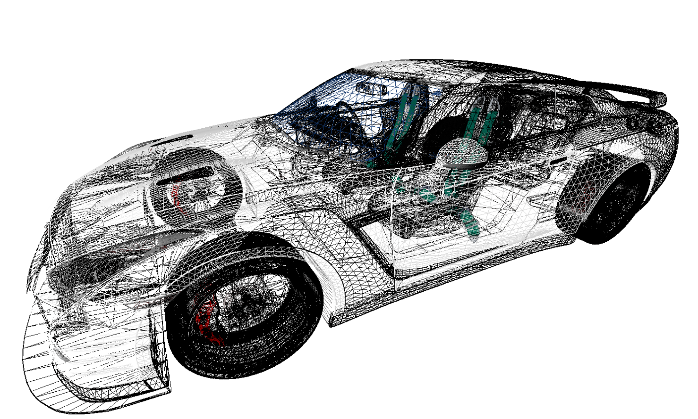
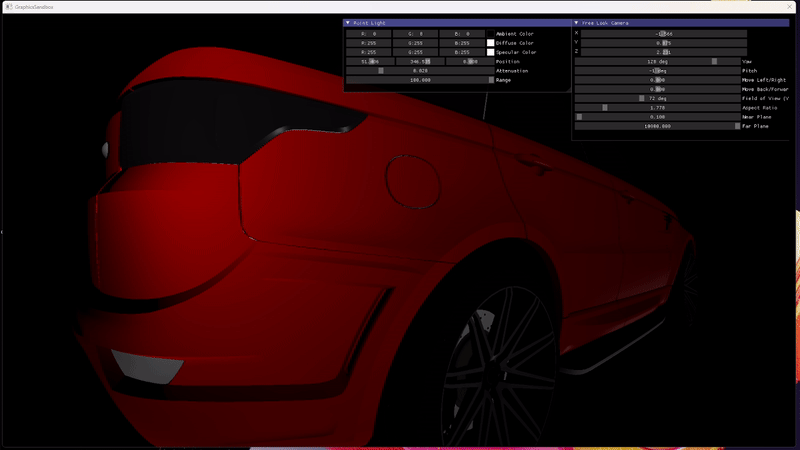
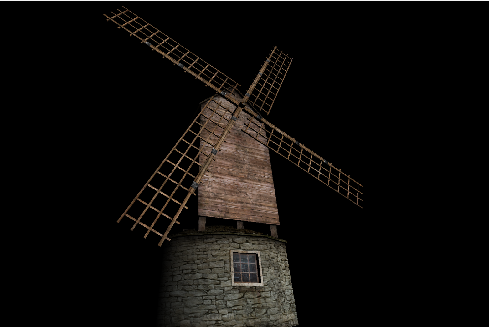

# GraphicSandbox

[](LICENSE)

# About
This repository serves as an experimental playground for 3D graphics, with a focus on DirectX with Modern C++. It includes implementations of various features such as Phong shading, a free-look camera, support for loading different model formats, material and texture loading, a timer, keyboard and mouse controls, and VR support through Valve's OpenVR. The project aims to provide a comprehensive foundation for exploring and learning 3D graphics techniques within the DirectX framework.

## Repo Structure

Most of the project's code I have provide is in the "Code" folder. I think the rest is pretty easy to understand.
I have kept a Experimental folder for new features and concepts I'm learning.

## Additional Resources





## Getting Started

Follow these steps to get started with the project:

1. **Clone the Repository:**
   ```bash
   git clone https://github.com/mitch344/GraphicSandbox/GraphicSandbox.git
   
2. **Install Assimp (optional):**
   Install Assimp to the default location if you want to load models.
[Install Assimp](https://kimkulling.itch.io/the-asset-importer-lib)

3. **Open the GraphicSandbox.sln:**
Open the .sln file with Visual Studio 2022
[Install Visual Studio 2022]([https://kimkulling.itch.io/the-asset-importer-lib](https://visualstudio.microsoft.com/)https://visualstudio.microsoft.com/)
