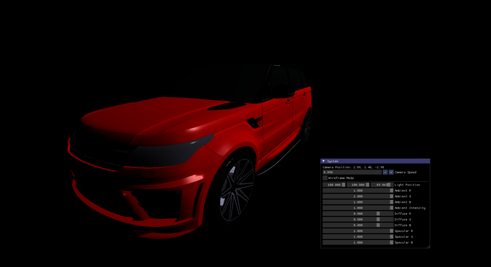
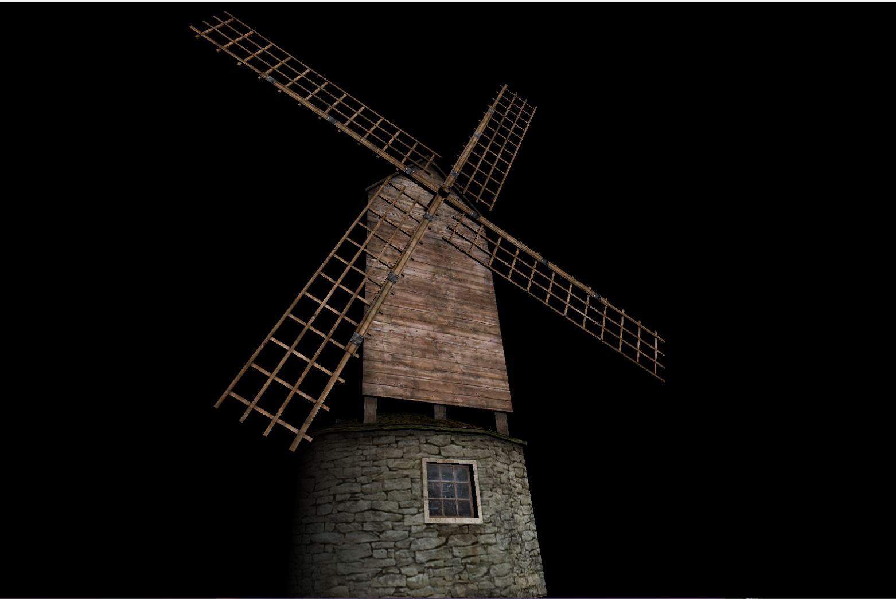

# GraphicSandbox

[](LICENSE)

# DirectX (D3D11) Project

This DirectX (D3D11) project is designed for experimental and educational purposes, focusing on enhancing your skills and implementing exciting features. The project showcases the following key components:

- **Phong Shading**: Implementation of Phong shading for realistic lighting in 3D scenes.
- **Free Look Camera**: Integration of a free-look camera system to provide greater control and flexibility to users.
- **Model Loading**: Loading 3D models to populate scenes with objects and assets.
- **Materials and Textures**: Application of materials and textures to models for a visually engaging experience.
- **Timer**: Integration of a timer for time-based functionality within the application.
- **Intuitive Controls**: Creation of an intuitive control scheme to navigate and interact with the program.
- **VR (Virtual Reality)**: Exploration of the potential for VR integration within the application.

## Repo Structure

Most of the project's code I have provide is in the "Code" folder. I think the rest is pretty easy to understand.
I have kept a Experimental folder for new features and concepts I'm learning.

## Additional Resources

If you need guidance on starting a simple D3D12 pipeline, you can refer to the following Gist files to get started:

[D3D12Pipeline.h](https://gist.github.com/mitch344/8ce6c7a6bf129aac659615b194857f8d) , [D3D12Pipeline.cpp](https://gist.github.com/mitch344/949f9ef9cc92f668d0acbf1356c5af7e), &
[D3D12ConstantBuffer.h](https://gist.github.com/mitch344/e6c315d1d72441933630618a2a7e30c9)




## Getting Started

Follow these steps to get started with the project:

1. **Clone the Repository:**
   ```bash
   git clone https://github.com/mitch344/GraphicSandbox/GraphicSandbox.git

2. **Extract the Code:**
   Extract the contents of the "Code" folder to the root of the GraphicSandbox folder (this step is for now)
   
3. **Install Assimp (optional):**
   Install Assimp to the default location if you want to load models.
[Install Assimp](https://kimkulling.itch.io/the-asset-importer-lib)

4. **Open the GraphicSandbox.sln:**
Open the .sln file with Visual Studio 2022
[Install Visual Studio 2022]([https://kimkulling.itch.io/the-asset-importer-lib](https://visualstudio.microsoft.com/)https://visualstudio.microsoft.com/)



## VRSupport (Experimental)


1. **Install your VR heasets Software**
   - [Meta Quest software](https://www.meta.com/quest/setup/) (For Quest Heasets)

2. **SteamVR/Runtime on Steam:**
   - [SteamVR](https://store.steampowered.com/app/250820/SteamVR/).

    **Optional SteamVR via DMS (Offline Installer):**
   - [Vive Business DMS Package](https://business.vive.com/us/support/dms/category_howto/downloading-the-dms-package.html).
   - This DMS Package method might be outdated and no longer a valid method.
   - My testing was done using this method with SteamVR 1.18.7 using the openvr-legacy SDK in my Dependencies folder. However, I don't recoomend this. Get it from Valves Github.
     
3. **Add the latest OpenVR SDK to the Dependencies folders:**
   - [OpenVR](https://github.com/ValveSoftware/openvr/releases).
   - If you mismatch the SteamVR and the SDK you will get errors. Headsup the VRCompoistor will come back as null but the VRSystem intalization/DLL will load properly. In this case your SteamVR and SDK aren't compatible with each other.
     I ran into this issue can be a little confusing while debugging.
